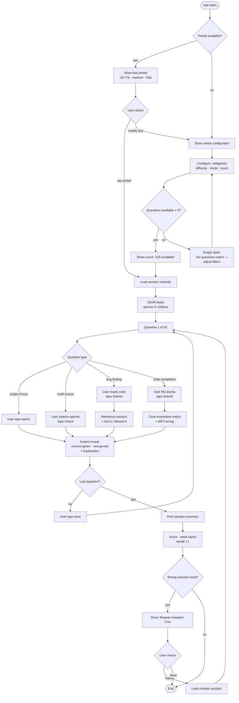
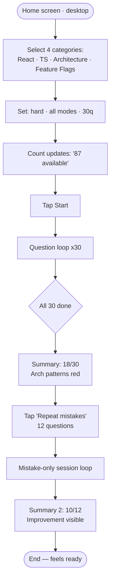
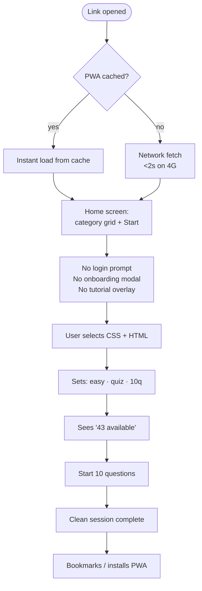
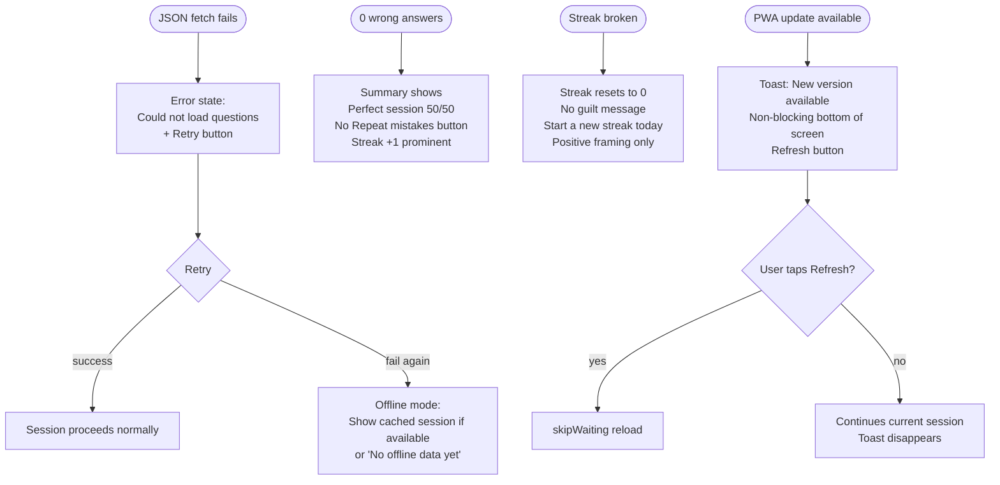

# UX Design Specification — InterviewOS

**Author:** Vadym
**Date:** 2026-03-22

---

<!-- UX design content will be appended sequentially through collaborative workflow steps -->

## Executive Summary

### Project Vision

InterviewOS is a personal mobile-first interview preparation SPA for senior frontend engineers. Its core purpose is combating cognitive atrophy caused by AI-heavy workflows — a daily habit tool (1-hour sessions) for reinforcing theoretical fundamentals from trainee to principal/staff depth across 17 topic categories. The adaptive algorithm tracks per-topic error rates and surfaces weak areas more frequently, creating a personalized learning loop without manual curation.

### Target Users

**Primary — The Working Lead (Vadym archetype):**
- Senior/Lead Frontend Engineer with deep practical expertise
- Executes autonomously at high level, offloads much of coding to AI tools
- Cannot reliably recall the *why* behind decisions in interview settings
- Usage context: mobile, morning sessions, single-thumb, bed/commute
- Needs: zero friction, focused content, confidence-building through repetition

**Secondary — Referred Colleague:**
- Frontend engineer who receives a shared link
- No account, no onboarding — arrives at category grid, starts immediately
- Read-only, frictionless, zero commitment required

### Key Design Challenges

1. **Session Configurator complexity on mobile** — 6 parameters (categories, difficulty, mode, count, order, presets) must be navigable with one thumb without feeling overwhelming
2. **4 question type consistency** — single-choice, multi-choice, bug-finding, and code-completion have fundamentally different interaction models but must feel part of one coherent system
3. **Deep focus on a small screen** — code snippets, syntax highlighting, and explanations require careful information hierarchy to work at 375px width

### Design Opportunities

1. **Terminal aesthetic as identity** — retro monospace design immediately signals "built for serious developers", differentiating from playful edtech tools
2. **Answer reveal moment** — the emotional peak of each question; an opportunity for a memorable micro-interaction that reinforces memory
3. **Making the algorithm visible** — two-surface approach: (A) home screen shows a compact "Algorithm recommends" widget with top weak topics before session start; (B) post-session summary shows per-topic error rate deltas ("Closures: 61% → appeared 8× this session"). Algorithm is a companion, not a black box.

## Core User Experience

### Defining Experience

The defining experience of InterviewOS is the question loop: read → answer → reveal → absorb → next. This cycle must feel effortless — zero UI friction, zero ambiguity, zero waiting. Every tap has immediate visual feedback. Every answer reveal is unambiguous. Every "Next" is one tap away. The mental energy goes entirely to the question, not the interface.

The session ends when the user decides it ends — either by hitting the configured question count or manually stopping. The post-session summary is the reward: a clear view of what was learned, what needs work, and what the algorithm will surface more tomorrow.

### Platform Strategy

**Primary platform:** Mobile web (375–430px viewport), touch-based, single-thumb operation. Primary usage context: morning, lying in bed, one hand occupied. Every tap target ≥ 44×44px. Primary actions (Next, Check, Submit) anchored to bottom of viewport — thumb zone.

**Secondary platform:** Desktop web (≥ 1024px). Same app, wider content area, comfortable line lengths, keyboard navigation supported (Tab, Enter, arrow keys). No hover-only interactions.

**PWA:** Installable to home screen. Offline-capable after first load. Update toast on new version — non-blocking, user-initiated.

**No native app:** Web-only. PWA provides sufficient "app-feel" for this use case.

### Effortless Interactions

1. **Session start via preset** — one tap to relaunch yesterday's session configuration; no re-configuration required
2. **Single-choice answer** — tap an option, instant reveal, no confirmation required; the interaction is complete in one gesture
3. **Next question** — always one tap; no modal, no animation delay >200ms
4. **JSON data load** — spinner visible, then immediate session start; user never waits at a blank screen
5. **Offline launch** — cached PWA loads instantly; user is inside the app before knowing if they're online

### Critical Success Moments

1. **First answer reveal** — the user's first experience of correct/wrong feedback defines whether the product feels polished or amateurish; colour, icon, and explanation must land simultaneously and clearly
2. **Post-session summary** — after 50 questions, the summary must feel like a reward: score prominent, weak topics actionable, "Repeat mistakes" button visible — not buried
3. **Adaptive feedback loop** — when the user notices "closures keep appearing" and then sees their error rate drop, the algorithm becomes tangible; this is the moment that converts a user into a daily habit
4. **Zero-friction first visit (colleague)** — landing on the app and being inside a quiz in <10 seconds, no registration, no onboarding

### Experience Principles

1. **Friction is the enemy** — every extra tap, confirmation, or loading state between the user and the next question is a failure
2. **The question is the hero** — UI elements exist only to serve the question content; nothing competes for attention
3. **Immediate, unambiguous feedback** — every interaction has a clear result within 100ms; correct/wrong is never a question
4. **Reward the habit** — streak tracking, records, algorithm transparency all serve one purpose: making the user want to open the app tomorrow morning
5. **Terminal precision** — the aesthetic is not decorative; it signals that this tool is built by a developer for developers; every pixel is deliberate

## Desired Emotional Response

### Primary Emotional Goals

**Core state:** Sharp focus — the feeling of deliberate mental work, not passive consumption and not anxious cramming. The user should feel like a developer running a benchmark on their own knowledge.

**Differentiating emotion:** Confidence through evidence. Not the manufactured confidence of gamification ("you earned a badge!"), but earned confidence: "I answered 38/50. Closures are my weakness. Tomorrow I'll see them more. I know exactly where I stand."

### Emotional Journey Mapping

| Stage | Desired Emotion | Design Response |
|---|---|---|
| App open / home screen | "This is mine" — immediate belonging | Terminal aesthetic, no onboarding wall, recognisable minimalism |
| Session configurator | Control and intention | Clear parameter display, live question count, preset recall |
| Question loading | Anticipation, zero anxiety | Fast load (<2s), progress indicator, no blank screen |
| Answering a question | Flow — absorbed in the problem | Distraction-free card, no chrome competing for attention |
| Correct answer reveal | Confirmation — "I knew it" | Clean green signal, brief positive reinforcement, explanation deepens understanding |
| Wrong answer reveal | Discovery — "now I get it" | No shame response; explanation is the main event, not the wrong mark |
| Post-session summary | Productive morning — earned satisfaction | Score prominent, weak topics specific and actionable, streak visible |
| Return visit next day | Habit pull — mild anticipation | Streak continuity, algorithm transparency ("these topics need work") |

### Micro-Emotions

**Target states:**
- **Confidence** (not arrogance) — from transparent progress tracking
- **Curiosity** — wrong answers should trigger "why?" not "damn"
- **Mastery** — the visible decline of error rates over weeks
- **Ownership** — this tool belongs to the user; it adapts to them specifically

**States to avoid:**
- **Anxiety** — from cluttered UI, unclear next actions, or overwhelming session setup
- **Guilt** — streak breaks should be forgiving; missing days shouldn't punish
- **Boredom** — the adaptive algorithm exists specifically to prevent this
- **Confusion** — every interactive state must be unambiguous

### Design Implications

- **Confidence → Transparent algorithm** — show error rate trends, explain why certain topics appear more; the algorithm is a trusted advisor, not a black box
- **Discovery → Explanation-first reveals** — wrong answer feedback leads with the explanation, not the red X; the UI hierarchy says "here's what you learn" not "you failed"
- **Flow → Distraction-free question card** — during a question, nothing exists except the question, the options, and the progress indicator; all non-essential UI is hidden or muted
- **Ownership → Adaptive personalisation visible** — small contextual hints ("closures: 60% error rate — appearing more frequently") make the user feel the app knows them

### Emotional Design Principles

1. **Evidence over encouragement** — skip empty positive reinforcement; show real data that earns genuine confidence
2. **Errors are learning, not failure** — visual design of wrong-answer states should feel like discovery, not punishment
3. **Make the algorithm a companion** — surface adaptive logic in plain language so users trust and appreciate the personalisation
4. **Minimal emotional friction** — the UI should never generate anxiety, confusion, or guilt; it is a calm, precise tool
5. **The streak is a feature, not a cage** — daily habit tracking motivates without punishing; a broken streak is "resume tomorrow", not a shame moment

## UX Pattern Analysis & Inspiration

### Inspiring Products Analysis

**Linear**
- Solves visual noise problem: single accent colour, dark background, monospace text, no gradients or decorative elements
- Keyboard-first philosophy: every action reachable without a mouse; feel of precision and speed
- Command palette (⌘K) as a power-user shortcut — signals "built for experts"; accessible even without knowing the shortcuts
- Transferable: the visual restraint philosophy; the feeling that every pixel earned its place

**Vercel Dashboard**
- Information hierarchy through typographic weight, not colour
- Status indicators are surgical: green dot = live, red = failed; no explanation needed
- Empty states are informative and actionable, never just blank
- Transferable: typographic hierarchy for question cards; surgical correct/wrong indicators

**Anki (Spaced Repetition)**
- The "Again / Hard / Good / Easy" post-answer rating is the entire product interaction — proof that a single decision per card is enough
- Progress is invisible during a session but visible in long-term graphs; the algorithm is trusted, not explained on every card
- Offline-first by nature; no loading anxiety
- Transferable: the minimal post-answer interaction model; trusting the algorithm to work silently

**VS Code**
- Syntax highlighting as a language that developers already speak; no learning curve for code-heavy content
- Scrollable code panels with horizontal scroll on overflow — the established pattern for code blocks on any screen size
- Transferable: code display conventions (syntax highlighting palette, monospace font, line numbers optional)

### Transferable UX Patterns

**Navigation Patterns:**
- **Single-column focused view** (Linear issue detail) — during a question, remove all navigation; the question is the only thing on screen
- **Sticky bottom action bar** (mobile apps universally) — Next / Check / Submit always in thumb reach, regardless of content scroll position

**Interaction Patterns:**
- **Instant single-tap confirmation** (Anki card flip) — single-choice questions reveal on tap, no intermediate state; feels fast and decisive
- **Progressive disclosure for explanations** — explanation appears after answer but doesn't interrupt the visual flow; can be collapsed for speed runs
- **Preset/recent sessions** (any modern app launcher) — yesterday's session config surfaced prominently on home screen; one tap to resume habit

**Visual Patterns:**
- **Monochrome + single accent** (Linear, Vercel) — all UI in shades of grey/black; one accent colour (terminal green `#00ff87`) reserved for correct answers and primary CTAs only
- **Syntax highlight palette** (VS Code Dark+) — consistent colour mapping for keywords, strings, functions in code blocks; developers already know this language
- **Typographic hierarchy without colour** (Vercel) — weight and size carry hierarchy; colour is reserved for semantic meaning only

### Anti-Patterns to Avoid

- **Gamification badges and points** (Duolingo-style) — creates extrinsic motivation that masks actual learning; InterviewOS measures error rates, not streaks of tapping
- **Onboarding modals and tours** — the target user is a senior developer; explaining the UI is insulting; let them discover
- **Celebration animations on every correct answer** — interrupts flow; a brief colour change is sufficient; save animations for genuine milestones
- **Bottom navigation tabs** — InterviewOS has one primary flow; tabs imply multiple equal destinations; use a minimal header instead
- **Card stacks / swipe gestures** — swipe-to-next feels casual; an explicit "Next" tap is intentional and matches the deliberate learning tone
- **Progress bars that don't show granular position** — "Question 23/50" is more useful than a vague progress bar; precision aligns with the developer aesthetic

### Design Inspiration Strategy

**Adopt directly:**
- Linear's visual restraint: near-black background, single accent, no decorative elements
- Anki's minimal post-answer model: one clear action (Next), no rating friction in MVP
- VS Code's code display conventions: syntax highlighting, monospace font, horizontal scroll for overflow

**Adapt for InterviewOS:**
- Linear's command palette → adapted as session preset quick-launch on home screen (same power-user shortcut philosophy, simpler execution)
- Vercel's empty state design → adapted for zero-results session configuration (informative + actionable, not just a blank screen)
- Anki's "algorithm works silently" → adapted by surfacing a single insight per session summary ("closures +15% this week") without overwhelming the user with algorithm internals

**Avoid entirely:**
- Gamification mechanics (badges, points, streaks that punish breaks)
- Onboarding flows
- Swipe gesture navigation
- Multiple navigation tabs

## Design System Foundation

### Design System Choice

**shadcn/ui (new-york variant) + Tailwind CSS v4**

This is not a traditional component library — shadcn/ui provides copy-owned components that live in the project's source code. Combined with Tailwind v4's CSS-based configuration, this gives complete visual control with zero abstraction overhead.

### Rationale for Selection

1. **Ownership over components** — shadcn/ui components are copied into `src/components/ui/`; they can be modified freely without fighting a library's API or waiting for upstream updates
2. **Accessibility built-in** — Radix UI primitives underpin all interactive components; WCAG AA compliance comes without custom work
3. **Tailwind v4 CSS-native config** — theme tokens (colours, fonts, spacing) live in `src/index.css` under `@theme inline {}`; terminal palette is a CSS variable swap, not a config rebuild
4. **Solo developer velocity** — no design handoff, no Storybook overhead; code is the source of truth for the design system
5. **Stack already decided** — PROJECT_CONTEXT.md confirms shadcn/ui new-york and Tailwind v4; this step validates the choice, not revisits it

### Implementation Approach

**Font:**
- JetBrains Mono loaded via Google Fonts or self-hosted `@font-face`
- Applied as `font-family` default in `@theme` — affects all UI text
- System sans-serif fallback for long-form content (explanations) if monospace reduces readability at body text sizes

**Colour tokens in `src/index.css`:**
```css
@theme inline {
  --color-background: #0d0d0d;
  --color-surface: #1a1a1a;
  --color-surface-raised: #1e1e1e;
  --color-border: #2a2a2a;
  --color-text-primary: #e5e5e5;
  --color-text-muted: #6b7280;
  --color-accent: #00ff87;       /* terminal green — correct / CTA */
  --color-accent-alt: #3b82f6;   /* electric blue — alternative accent */
  --color-error: #ef4444;        /* wrong answers */
  --color-warning: #f59e0b;
}
```

**shadcn/ui component overrides:**
- `Button` — sharp corners (border-radius: 0 or 2px), monospace label
- `Card` — surface background, sharp border, no shadow
- `Badge` — used for difficulty tags (easy/medium/hard) and category chips
- `Progress` — session progress bar, accent colour fill
- `Separator` — subtle border colour dividers only

**Dark mode:**
- Default dark; light mode as secondary toggle (FR32)
- Implemented via `.dark` class on `<html>` (Tailwind v4 pattern)
- All colour tokens defined in both `:root` and `.dark` contexts

### Customization Strategy

**Minimal deviation from shadcn defaults:**
- Override only what serves the terminal aesthetic
- Preserve all Radix accessibility behaviours untouched
- No new primitives — compose existing shadcn components

**Terminal aesthetic deltas from defaults:**
- Remove all border-radius rounding → sharp corners everywhere
- Remove box-shadows → flat surfaces, border-only depth
- Replace default font → JetBrains Mono throughout
- Tighten spacing → 8px grid, more compact than shadcn's comfortable defaults
- Reduce animation duration → 100–150ms max; no spring animations

### DevPlayground — Component Isolation Environment

**Route:** `/dev-playground` (available **localhost only**)

**Implementation:** Route registered conditionally via `import.meta.env.DEV` in `src/router/modules/base.routes.tsx` — excluded from production builds automatically. No feature flag or auth required; Vite's build-time env var removes the route entirely from the production bundle.

**Purpose:** Minimal Storybook analog for visual regression checks and component development. Each new shadcn/ui component override and each custom InterviewOS component (QuestionCard, AnswerOption, SessionConfigurator, etc.) should have a section here showing all variants and states.

**Convention for adding components:**
- Add a `<section>` per component with a heading matching the component name
- Show all variants, sizes, and states (default, hover, active, disabled, correct, wrong)
- Keep sections independent — no shared state between component previews
- This page is the AI-assisted support reference: when a model needs context on a component's visual states, point it to the relevant DevPlayground section

**What belongs in DevPlayground (the bar):**
- ✅ Custom InterviewOS components (QuestionCard, AnswerOption, CodeBlock, etc.)
- ✅ shadcn/ui overrides that differ visually from defaults (Button, Badge, Input with terminal theme)
- ✅ Components with multiple non-obvious states (correct/wrong reveal, empty states, loading)
- ❌ Utility components with no visual states (pure logic hooks, providers)
- ❌ Page-level layouts (too coarse — use the actual page for that)
- ❌ Every minor prop variant that is trivially derivable from the component code

**Update rule:** When a new component is added to `src/components/`, the PR is not complete until a DevPlayground section exists for it — if it meets the bar above.

**Current content:** `Button` (variants, sizes, states) · `Input` (default, disabled, file, password)

## 2. Core User Experience

### 2.1 Defining Experience

**"Answer → Reveal → Understand → Next"**

The defining experience of InterviewOS is the question loop: the user reads a question, commits to an answer, sees immediately whether they were right, reads the explanation, and moves on. This cycle repeats 50 times in a 45-minute session. If this loop is fast, clear, and emotionally satisfying — the product succeeds. Everything else (configurator, algorithm, streaks) is infrastructure for this loop.

The defining moment within the loop is the **answer reveal**: the instant between tapping an option and seeing the result. This 50ms transition — option colour change, icon, explanation appearing — is the highest-density UX moment in the entire product. Getting it right means: unambiguous, immediate, non-punishing, educational.

### 2.2 User Mental Model

**What users bring:**
- Existing tools: LeetCode (overloaded, generic), Quizlet (passive flashcards), MDN (reference, not practice)
- Mental model: "quiz app" — they expect question → answer → next
- Developer instinct: distrust anything that feels like "learning software"; they prefer tools that feel like instruments

**What users love about existing tools:**
- Anki: the algorithm works; you trust it
- VS Code: keyboard shortcuts, speed, zero overhead

**What users hate:**
- Duolingo: gamification that patronises; streaks that guilt
- LeetCode: too broad, too competitive, not daily-habit-friendly
- Generic quiz apps: no adaptation, same questions each time

**Implication:** Users arrive with "quiz" as mental model — this is correct. No education needed. The terminal aesthetic signals "this is different" without requiring explanation.

### 2.3 Success Criteria

The core loop is successful when:

1. **Speed:** From home screen to first question in ≤3 taps (preset launch) or ≤8 taps (fresh configuration)
2. **Instant reveal:** Answer state change visible within 100ms of tap; no confirmation step for single-choice
3. **Explanation clarity:** User can read explanation and understand the "why" in ≤15 seconds; explanation is the centrepiece, not a footnote
4. **Next action obvious:** After reveal, "Next" is the only prominent action; no decision fatigue
5. **Session completion:** User finishes the configured question count without stopping early due to UX friction

### 2.4 Novel vs. Established Patterns

**Established patterns used (no education needed):**
- Multiple choice quiz — universal; no learning curve
- Code syntax highlighting — developers read this every day
- Progress indicator ("23 / 50") — universally understood
- Bottom sticky CTA on mobile — standard mobile pattern

**Established patterns with an InterviewOS twist:**
- **Answer reveal:** Standard correct/wrong colour, but explanation-first hierarchy (explanation is visually dominant over the correct/wrong indicator)
- **Session configurator:** Standard filter pattern, but with live question count update as filters change (immediate feedback on availability reduces configuration anxiety)

**Novel patterns (require intentional design):**
- **Adaptive algorithm transparency:** Showing "this topic appears more because your error rate is 60%" is not a standard quiz pattern; needs to be introduced subtly without interrupting flow
- **"Repeat mistakes" mode:** Common in educational apps but the trigger and re-entry into the loop needs careful UX design

### 2.5 Experience Mechanics

#### The Question Loop (primary flow)

**1. Initiation:**
- User taps "Start Session" (preset) or completes configurator and taps "Start"
- JSON loads (spinner shown if >200ms); session begins immediately when ready
- Question 1 appears: question text, options below, progress "1 / 50" at top

**2. Interaction by question type:**

| Type | User Action | System Response |
|---|---|---|
| Single-choice | Tap one option | Instant reveal: selected option colours, correct option colours, explanation appears, "Next" activates |
| Multi-choice | Tap options, tap "Check" | All selections evaluated simultaneously; correct/wrong per option; explanation appears |
| Bug-finding | Read code snippet, tap option or type answer, tap "Submit" | Reference solution shown; explanation shown; "Got it / Missed it" self-assessment |
| Code-completion | Fill blank(s) in code snippet, tap "Submit" | Case-insensitive match; correct or diff shown; explanation shown |

**3. Feedback:**
- Correct: option background → accent green (`#00ff87`), checkmark icon, explanation below
- Wrong: selected option → error red (`#ef4444`), correct option → accent green, explanation below
- Explanation: always shown regardless of correctness; visually equal weight to the answer indicator

**4. Completion:**
- "Next" tap advances to next question; no animation delay >150ms
- After final question: post-session summary screen
- Summary: score (38/50), weakest topics (closures 60%, generics 55%), streak +1, "Repeat mistakes" CTA if any wrong answers

## Visual Design Foundation

### Color System

**Philosophy:** Monochrome base with single semantic accent. Colour is reserved for meaning, not decoration.

| Token | Value | Usage |
|---|---|---|
| `--background` | `#0d0d0d` | App background |
| `--surface` | `#1a1a1a` | Cards, panels |
| `--surface-raised` | `#1e1e1e` | Elevated surfaces (modals, dropdowns) |
| `--border` | `#2a2a2a` | All borders — no shadows |
| `--text-primary` | `#e5e5e5` | Body text, question text |
| `--text-muted` | `#6b7280` | Secondary labels, metadata |
| `--accent` | `#00ff87` | Terminal green — correct answers, primary CTA, active states |
| `--accent-alt` | `#3b82f6` | Electric blue — links, info states (use sparingly) |
| `--error` | `#ef4444` | Wrong answers, error states |
| `--warning` | `#f59e0b` | Warnings only |

**Light mode overrides (FR32):**
- Background: `#ffffff` → `#f9f9f9`
- Surface: `#f4f4f5`
- Text primary: `#111111`
- Border: `#e4e4e7`
- Accent remains `#00ff87` (adjust luminosity if contrast fails AA)

**Semantic colour split (decided):**

| Colour | Token | Meaning | Used for |
|---|---|---|---|
| Terminal green | `--accent` | "correct / brand" | Correct answer reveal, logo, streak indicator |
| Electric blue | `--accent-alt` | "action / navigation" | Primary CTAs (Start, Next, Submit, Check), active/selected states, progress bar fill, focus rings |
| Error red | `--error` | "wrong / danger" | Wrong answer reveal, error states, destructive actions |

**Rule:** Green never appears on interactive controls (buttons, checkboxes, filters). Blue never appears as an answer feedback colour. The semantic boundary is strict — this prevents user confusion between "I tapped the right thing" and "I got the right answer".

**Remaining uses:**
- Disabled: `--text-muted` text + `--border` border, 40% opacity
- Code blocks: dedicated surface `#161616` with VS Code Dark+ syntax palette

### Typography System

**Primary font:** JetBrains Mono (weights: 400, 500, 600)
- Source: Google Fonts or self-hosted for offline PWA reliability
- Applied globally as `font-family` default
- Fallback: `'Fira Code', 'Cascadia Code', monospace`

**Type scale (8px base grid):**

| Role | Size | Weight | Line Height | Usage |
|---|---|---|---|---|
| `heading-1` | 24px | 600 | 1.3 | Page titles, session summary score |
| `heading-2` | 18px | 600 | 1.4 | Section headers, category names |
| `heading-3` | 16px | 500 | 1.4 | Card titles, question number |
| `body` | 16px | 400 | 1.6 | Question text, explanations |
| `body-sm` | 14px | 400 | 1.5 | Secondary labels, difficulty badges |
| `caption` | 12px | 400 | 1.4 | Metadata, timestamps |
| `code` | 14px | 400 | 1.7 | Code snippets (monospace, always) |

**Typography split (decided):**
- **JetBrains Mono** — all UI chrome: buttons, labels, badges, headers, question text, metadata, navigation
- **System sans-serif** (`system-ui, -apple-system, sans-serif`) — prose content only: explanation text, reference solution descriptions, error messages
- **Monospace** — all code snippets regardless of context

Rationale: monospace at 16px/1.6 reads 15–20% slower than proportional fonts for multi-sentence prose. Explanation panels are 3–6 sentences read under morning fatigue — this is the one place where readability wins over aesthetic consistency. All UI chrome stays monospace; the switch is invisible to casual users.

### Spacing & Layout Foundation

**Base unit:** 8px grid — all spacing is multiples of 8

| Scale | Value | Usage |
|---|---|---|
| `space-1` | 8px | Tight gaps: icon + label, tag padding |
| `space-2` | 16px | Component internal padding (mobile) |
| `space-3` | 24px | Component internal padding (desktop), section gaps |
| `space-4` | 32px | Page padding (desktop), major section separators |
| `space-6` | 48px | Large vertical rhythm breaks |

**Layout structure:**

- **Mobile (< 768px):** Single column, full-width cards, 16px page padding
- **Tablet (768–1023px):** Single column, 24px padding, max-width 680px centred
- **Desktop (≥ 1024px):** Single column, max-width 760px centred (reading width), 32px padding

**Sticky bottom bar (mobile only, < 1024px):**
- Height: 72px (action button 52px + 10px padding top/bottom)
- Background: `--surface` with top border `--border`
- Contains: primary CTA only (Next / Check / Submit)
- Scroll behaviour: fixed, always visible regardless of content length

**Desktop (≥ 1024px) — inline CTA:**
- Primary action button (Next / Check / Submit) renders inline, below ExplanationPanel or below answer options
- No sticky bar — desktop users have no thumb-reach constraint
- Button aligns right within the 760px content column

**Answer option layout:**
- Full width, minimum height 52px on mobile (FR spec)
- 16px horizontal padding, 14px vertical padding
- Sharp corners (0 border-radius)
- Border `--border` default → `--accent` on correct, `--error` on wrong

### Accessibility Considerations

- **Contrast:** All text on backgrounds must meet 4.5:1 (WCAG AA)
  - `--text-primary` (`#e5e5e5`) on `--background` (`#0d0d0d`): ~14:1 ✅
  - `--accent` (`#00ff87`) on `--background` (`#0d0d0d`): ~8.5:1 ✅
  - `--text-muted` (`#6b7280`) on `--background`: ~4.6:1 ✅ (borderline — verify)
- **Never colour alone:** Correct/wrong states always include icon + colour (NFR8)
- **Focus-visible:** All interactive elements have visible focus ring using `--accent` outline, 2px offset
- **Tap targets:** Minimum 44×44px on all interactive elements (NFR6)
- **Font minimums:** 16px question text, 14px secondary (NFR7)
- **Motion:** Respect `prefers-reduced-motion` — disable all transitions when set

## Design Direction Decision

### Design Directions Explored

4 directions generated in `ux-design-directions.html`:

- **A — Terminal Minimal:** Full-width single column, 2px progress line, bottom-anchored CTA, explanation with left-border accent. Purest distraction-free question view.
- **B — Card + Live Stats:** Sidebar showing live weak topics and streak alongside question card. Surfaces adaptive algorithm during session.
- **C — Dense / Keyboard-First:** Tightest layout, breadcrumb path, keyboard shortcuts visible, left-border option reveal. Desktop power-user focus.
- **D — Session Configurator:** Home screen layout showing category grid, filters, live question count, and presets. Entry-point UX validation.

### Chosen Direction

**A for question view + D for session configurator**

Direction A provides the cleanest question loop experience — full attention on the question, bottom-anchored Next, explanation-first reveal. Direction D validates the configurator layout which is the second most critical screen.

### Design Rationale

- A's single-column focus aligns directly with the "question is the hero" experience principle
- A's bottom-bar CTA pattern is mobile-thumb-optimised without sidebar distraction
- D's category grid + live count + preset recall captures all configurator FRs in a scannable layout
- Both directions use identical token system — no new design decisions needed to implement both

### Implementation Approach

- Question view follows Direction A layout as the reference implementation
- Session configurator follows Direction D layout
- Post-session summary: adapt Direction A's bottom-bar + score-prominent pattern
- DevPlayground: render Direction A question card variants (all 4 question types) as the first component section to add

## User Journey Flows

### Journey 1: Daily Morning Session (Primary Happy Path)

**Entry:** App icon on home screen (PWA) → Home screen loads instantly from cache



**Key UX decisions:**
- Preset is the primary CTA on home screen — not "New Session"
- Question count shows immediately as filters change (live update)
- Empty state is instructional, not blank — suggests which filter to relax

---

### Journey 2: Pre-Interview Targeted Session

**Entry:** Desktop browser, direct URL → Home screen



**Key UX decisions:**
- "Repeat mistakes" CTA is prominent in summary — not buried below the fold
- Second summary shows delta vs first run to show improvement
- Desktop: keyboard navigation (1–4 to select option, Enter to confirm/next)

---

### Journey 3: Colleague First Visit (Zero-Friction)

**Entry:** Shared link → app loads



**Key UX decisions:**
- Zero auth, zero onboarding — land on configurator immediately
- PWA install prompt appears after first session completion (not on first visit)
- No account creation CTA anywhere in the app

---

### Journey 4: Error & Edge Case Flows



---

### Journey Patterns

**Navigation pattern:** Single-column flow with back navigation limited to one step. "Back" undoes only the last answer reveal (misclick protection for single-choice instant-reveal). It does not re-enter the session history further. Back button appears in the question header only after first answer is revealed, not before.

**Feedback pattern:** Every user action that changes state has a visible response within 100ms; loading states use spinner only when >200ms; never blank screen

**Error pattern:** All error states are instructional (tell user what happened + what to do next); never just an error code or generic message

**Preset pattern:** Presets are first-class citizens on the home screen; they reduce the configurator to a one-tap interaction for habitual users

### Flow Optimization Principles

1. **Preset-first home screen** — reduces daily session start from 8 taps to 1
2. **Live question count** — eliminates the "start → zero results" dead end; user knows before starting
3. **One-step back for misclick protection** — single-choice instant reveal can cause fat-finger errors on mobile; Back undoes only the most recent answer and is available only immediately after reveal; beyond one step the session moves forward only
4. **Explanation always shown** — removes the decision "should I read this?"; always present, user scrolls past if not needed
5. **Repeat mistakes as natural continuation** — post-session summary flows directly into mistake session without reconfiguring

## Component Strategy

### Design System Components (shadcn/ui — use as-is with token overrides)

| Component | Usage in InterviewOS | Override needed |
|---|---|---|
| `Button` | Next · Check · Submit · Start Session · Repeat mistakes | Sharp corners, monospace label |
| `Badge` | Difficulty tags (easy/medium/hard), category chips | Colour per difficulty level |
| `Progress` | Session progress bar | Accent fill colour |
| `Input` | Code-completion blank fill, short text answer | Monospace font |
| `Separator` | Section dividers | Border colour only |
| `Toast` | PWA update notification | Bottom position, non-blocking |
| `Skeleton` | Loading placeholder while JSON fetches | Surface colour |
| `Dialog` | End session confirmation (if mid-session exit) | Sharp corners |
| `Checkbox` | Multi-choice option selection | Accent colour when checked |

### Custom Components

#### `QuestionCard`
**Purpose:** Wraps question text, metadata tags, and progress indicator for the active question

**Anatomy:** `[progress "23/50"] [category badge] [difficulty badge] [question text]`

**States:** loading (skeleton) · active (default) · answered (revealed — correct/wrong)

**Variants:** standard (text only) · code (contains CodeBlock) · long (scrollable question text)

**Accessibility:** `role="article"`, question text as `<h2>`, progress as `aria-label="Question 23 of 50"`

---

#### `AnswerOption`
**Purpose:** Single selectable answer option for single-choice and multi-choice questions

**Anatomy:** `[key indicator A/B/C/D] [option text]`

**States:** default · hover · selected (pre-reveal) · correct (post-reveal) · wrong (post-reveal) · disabled (other options after single-choice tap)

**Variants:** radio (single-choice — tap to reveal) · checkbox (multi-choice — tap to select, Check button to reveal)

**Accessibility:** `role="radio"` or `role="checkbox"`, `aria-checked`, `aria-disabled`; keyboard: Space/Enter to select

**Mobile spec:** min-height 52px, full width, 16px horizontal padding

---

#### `CodeBlock`
**Purpose:** Syntax-highlighted code display for bug-finding and code-completion questions

**Anatomy:** `[language label] [copy button] [code content with highlights]`

**States:** display-only · with blank inputs (code-completion) · with error highlight (bug-finding answer reveal)

**Variants:** readonly · interactive (code-completion blanks as `<input>` elements inline)

**Accessibility:** `role="region"`, `aria-label="Code snippet"`, horizontal scroll on overflow, never breaks on mobile

**Implementation note:** Use `highlight.js` or `prism` for syntax highlighting; VS Code Dark+ colour palette

---

#### `ExplanationPanel`
**Purpose:** Always-shown explanation after answer reveal

**Anatomy:** `[label "Explanation"] [explanation text] [optional: reference solution for bug/code types]`

**States:** hidden (pre-answer) · visible (post-answer, animates in within 100ms)

**Variants:** text-only · with reference solution code block

**Accessibility:** `role="complementary"`, `aria-label="Explanation"`, focus moves to panel on reveal for keyboard users

---

#### `SessionSummary`
**Purpose:** Post-session results screen

**Anatomy:** `[score "38 / 50"] [weak topics list] [streak indicator] [action CTAs]`

**States:** default · perfect-score (no repeat mistakes CTA) · with-mistakes (repeat CTA prominent)

**CTAs:** "Repeat mistakes" (primary, visible only if wrong answers exist) · "New session" (secondary) · "Home" (ghost)

**Accessibility:** Score as `<h1>`, weak topics as `<ul>`, streak as complementary info

---

#### `SessionConfigurator`
**Purpose:** Home screen session setup form

**Anatomy:** `[algorithm widget] [category grid] [difficulty filter] [mode filter] [count input] [order toggle] [live question count] [preset list] [Start CTA]`

**Algorithm widget (top of configurator, shown only when data exists):**
- Compact block: "Algorithm recommends:" + up to 3 weak topics with error rate badges
- Example: `Closures 61% · TypeScript Generics 55% · Promises 40%`
- Tapping a topic pre-selects its category in the grid
- Hidden on first visit (no data yet); appears after first completed session

**Per-category error rate in grid (subtle, non-intrusive):**
- Small badge on category button showing current error rate if > 30%: `React 48%`
- Below 30% — no badge shown (not distracting for strong topics)
- Allows informed pre-session decisions without a dedicated stats screen

**States:** empty (no selection) · configured (selection made, count > 0) · empty-results (count = 0, show instructional state)

**Live update:** question count recalculates on every filter change without user action (debounced 150ms)

**Accessibility:** category grid as `role="group"` with checkboxes, filter groups as `role="radiogroup"`

---

#### `PresetRow`
**Purpose:** Single saved session preset in the preset list

**Anatomy:** `[preset name] [config summary "JS+TS · medium · 50q"] [last-used date] [delete button]`

**States:** default · hover · active (being launched)

**Accessibility:** `role="button"` for launch, delete button has `aria-label="Delete preset [name]"`

---

### Component Implementation Strategy

- All custom components follow the `ComponentName/ComponentName.tsx + useComponentName.ts` pattern (project convention)
- Each component has a section in `DevPlayground` showing all states
- Custom components use only design system tokens — no hardcoded colours or spacing
- No component introduces new shadcn/ui dependencies; compose from existing primitives

### Implementation Roadmap

**Phase 1 — Core question loop (enables MVP):**
1. `AnswerOption` — single-choice variant first (most common question type)
2. `QuestionCard` — standard + code variants
3. `ExplanationPanel` — text-only variant
4. `CodeBlock` — readonly variant (bug-finding)

**Phase 2 — Session management:**
5. `SessionConfigurator` — category grid + filters + live count
6. `PresetRow` — preset display + launch
7. `SessionSummary` — default + with-mistakes variants

**Phase 3 — Completion:**
8. `AnswerOption` — multi-choice + checkbox variant
9. `CodeBlock` — interactive variant (code-completion blanks)
10. `ExplanationPanel` — with reference solution variant

## UX Consistency Patterns

### Design Token Rule

**No magic values anywhere in component code.** All colours, spacing, radii, and durations reference CSS variables defined in `src/index.css` under `@theme inline {}`. In components: Tailwind utility classes only (`bg-accent`, `border-error`, `text-muted`, `p-2`, etc.). Raw hex values (`#00ff87`) exist only in `index.css` — nowhere else.

### Button Hierarchy

| Level | Variant | Usage | Example |
|---|---|---|---|
| Primary | Solid accent on black | One per screen, most important action | Start Session · Next · Submit |
| Secondary | Outline accent | Important but not critical | Repeat mistakes · Save preset |
| Ghost | Text only, muted | Low-priority actions | Home · Skip · Cancel |
| Destructive | Outline error | Irreversible actions | Delete preset · Reset weights |

**Rules:**
- Never more than one primary button visible at a time
- Primary CTA always anchored to bottom bar on mobile
- All buttons: sharp corners (border-radius 0), monospace font, letter-spacing 0.05em
- Disabled state: 40% opacity, no `cursor: not-allowed` — just unresponsive

### Feedback Patterns

**Answer reveal (correct):**
- Option background → `bg-accent/10` (dark green tint via Tailwind opacity modifier)
- Option border → `border-accent`
- Checkmark icon appears left of option key
- Explanation panel slides in below (150ms ease-out)
- No sound, no celebration animation

**Answer reveal (wrong):**
- Selected option → `bg-error/10` background, `border-error`
- Correct option → `bg-accent/10` background, `border-accent`
- Cross icon on selected, checkmark on correct
- Explanation panel identical to correct — same visual weight

**Loading state:**
- Spinner appears after 200ms (avoids flicker on fast connections)
- Skeleton loaders for question content during JSON fetch
- Never a blank screen

**Error state:**
- Inline message: icon + specific text + retry action
- "Could not load questions. Check your connection." — not "Something went wrong"
- Retry button always present for network errors

**Toast notifications:**
- Bottom of screen, non-blocking
- Auto-dismiss after 5s unless action required
- PWA update toast persists until user acts or dismisses

### Form Patterns

**Session configurator:**
- Category selection: toggle buttons (tap to select/deselect)
- Filter groups (difficulty, mode): radio-style — always one selected
- Question count: numeric input; min 1, max = available count
- All changes immediately update live question count (debounced 150ms)

**Code-completion inputs:**
- Inline `<input>` elements within code block, styled as code (monospace, same background)
- Submit validates all blanks simultaneously
- Case-insensitive, trims whitespace (FR45)

**Validation:**
- No messages during typing — only on Submit
- Inline error below specific blank if wrong

### Navigation Patterns

**App header (all screens):**
- Left: logo → home link (disabled during active session)
- Right: language toggle (RU/EN) + theme toggle
- During session: "End session" ghost button in header

**In-session:**
- Back button available only immediately after answer reveal (misclick protection); undoes last answer only; disappears once Next is tapped
- "End session" exits with confirmation Dialog
- Progress indicator in QuestionCard only

**Post-session:**
- "Repeat mistakes" → loads mistake session
- "New session" → configurator with last config pre-filled
- "Home" → configurator reset

### Empty & Loading States

**Zero-results configurator:**
> No questions match your selection.
> Try removing a difficulty filter or selecting more categories.
> [235 total questions available]

**JSON fetch failure (full):**
> Could not load questions. Check your connection and try again.
> [Retry] — primary CTA. No session without data; the app has no value without questions.

**JSON fetch failure (partial — one category fails out of several):**
> Some questions could not be loaded ([Category] unavailable).
> [Continue with N questions] [Retry all]
> If Continue: session starts with available data; failed category silently excluded.

**Offline, no cache:**
> You're offline. Complete a session online first to enable offline mode.

**No presets yet:** muted "No saved presets yet" — no illustration, no empty-state graphic

**Perfect session (0 wrong answers):**
- Score: "50 / 50" — displayed prominently
- Streak: +1, shown with emphasis
- No "Repeat mistakes" CTA — replaced with three equal-weight actions:
  - [Try again] — same config, reshuffled questions
  - [Try something else] — returns to configurator, config reset
  - [Clear session weights] — resets adaptive weights for this topic set (optional power-user action)
- Tone: clean acknowledgement, not a celebration explosion — consistent with "evidence over encouragement" principle

### Interaction Micro-Patterns

- **Tap feedback:** `active:opacity-80` press state on all tappable elements — instant visual confirmation
- **Focus-visible:** `outline-2 outline-accent-alt outline-offset-2` on all keyboard-focused elements (blue, not green — see colour split)
- **Code block scroll:** `max-height: 320px` on mobile, `max-height: 480px` on desktop; internal vertical scroll when content exceeds max-height; horizontal scroll for long lines; pattern follows GitHub code view and VS Code embedded diff — never expands to push page content
- **Transition budget:** reveals ≤150ms; page transitions ≤200ms; `prefers-reduced-motion` disables all

## Responsive Design & Accessibility

### Responsive Strategy

**Philosophy:** Mobile-first — design for 375px, enhance for larger screens. Desktop is a bonus, not the baseline.

**Mobile (< 768px) — primary target:**
- Single column, full-width components
- 16px page padding (left + right)
- Primary actions in sticky bottom bar (thumb zone)
- No hover states — touch only
- Font sizes never below 16px for question text
- Code blocks: horizontally scrollable container

**Tablet (768–1023px) — comfortable secondary:**
- Single column, max-width 680px centred
- 24px page padding
- Touch-optimised (same interaction model as mobile)
- No sidebar — layout remains single-column

**Desktop (≥ 1024px) — enhanced secondary:**
- Single column, max-width 760px centred (reading width)
- 32px page padding
- Keyboard navigation: 1–4 select option, Enter confirm, Space toggle
- Hover states on interactive elements
- No multi-column layout — more whitespace, same content density

### Breakpoint Strategy

Tailwind v4 mobile-first breakpoints:

| Prefix | Min-width | Target |
|---|---|---|
| (none) | 0px | Mobile — primary design target |
| `sm:` | 640px | Large mobile / small tablet |
| `md:` | 768px | Tablet |
| `lg:` | 1024px | Desktop |
| `xl:` | 1280px | Wide desktop (max-width container clamps, no new layout) |

**Key layout changes at breakpoints:**
- `md:` — page padding 16px → 24px; max-width 680px
- `lg:` — page padding → 32px; max-width 760px; hover states enabled
- Bottom sticky bar: mobile only (< 1024px); inline CTA on desktop

### Accessibility Strategy

**Target:** WCAG 2.1 Level AA — leveraged from shadcn/ui (Radix UI) defaults

| Area | Requirement | Implementation |
|---|---|---|
| Colour contrast | 4.5:1 text, 3:1 UI components | Verified in Visual Foundation token table |
| Non-colour cues | Correct/wrong never by colour alone | Icon + colour always (NFR8) |
| Tap targets | ≥ 44×44px | AnswerOption (52px min), all buttons |
| Font sizes | ≥ 16px question text, ≥ 14px secondary | Enforced in type scale |
| Keyboard nav | Full navigation without mouse | Radix primitives + session keyboard handler |
| Focus visible | 2px outline on all interactive elements | `focus-visible:outline-accent` global rule |
| ARIA | Roles and labels on all custom components | Specified per component in Component Strategy |
| Reduced motion | No transitions when `prefers-reduced-motion: reduce` | Global CSS rule in `index.css` |
| Language | `lang` attribute updated on locale change | i18n store drives `document.documentElement.lang` |

**Rule:** Never override or disable Radix UI accessibility props on shadcn/ui components.

### Testing Strategy

**Responsive:** Chrome DevTools — iPhone 14 Pro (390px), Pixel 7 (412px), iPad (768px); real device on iOS Safari + Chrome Android

**Accessibility:**
- `axe-core` via Vitest — automated, runs in CI
- VoiceOver manual walkthrough of full session flow
- Keyboard-only session completion test (home → summary, no mouse)
- DevTools contrast checker for all token pairs

**PWA:** Lighthouse audit; offline mode via DevTools → Network → Offline

### Implementation Guidelines

- Tailwind responsive prefixes only (`md:`, `lg:`) — never raw media queries in JS
- All spacing via Tailwind scale — never `style={{ padding: '14px' }}`
- Semantic HTML: `<button>` not `<div onClick>`, `<nav>` not `<div className="nav">`
- Focus management: after answer reveal, focus moves to ExplanationPanel or Next button
- Skip link: `<a href="#main-content" className="sr-only focus:not-sr-only">` in App shell
- `aria-live="polite"` on question counter for screen reader announcements
- Every decorative icon: `aria-hidden="true"`
